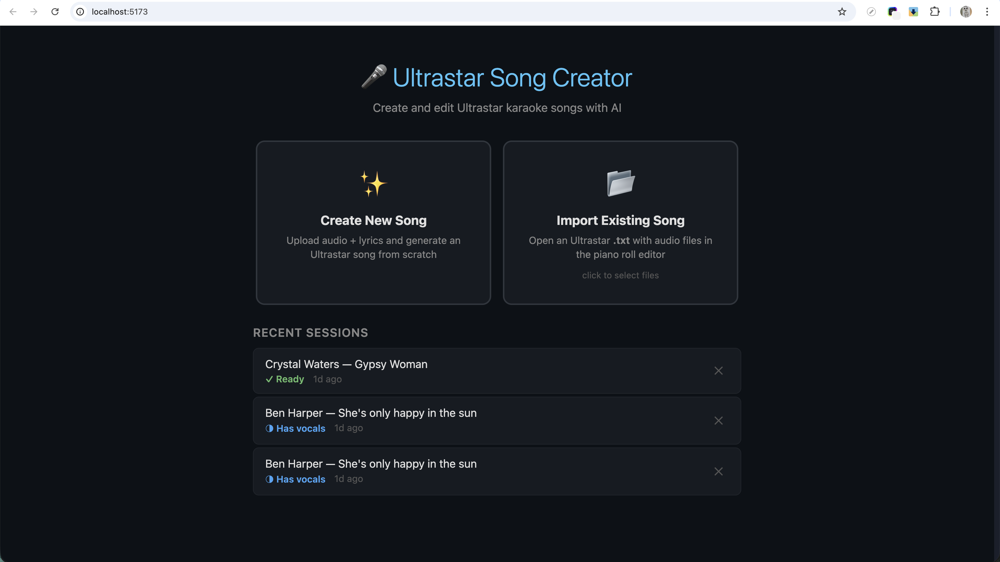
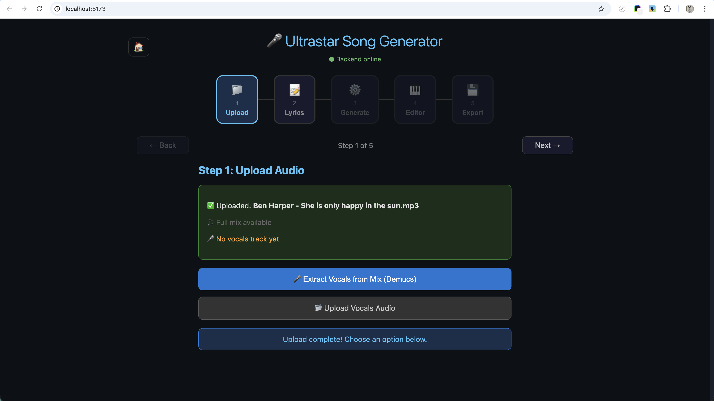
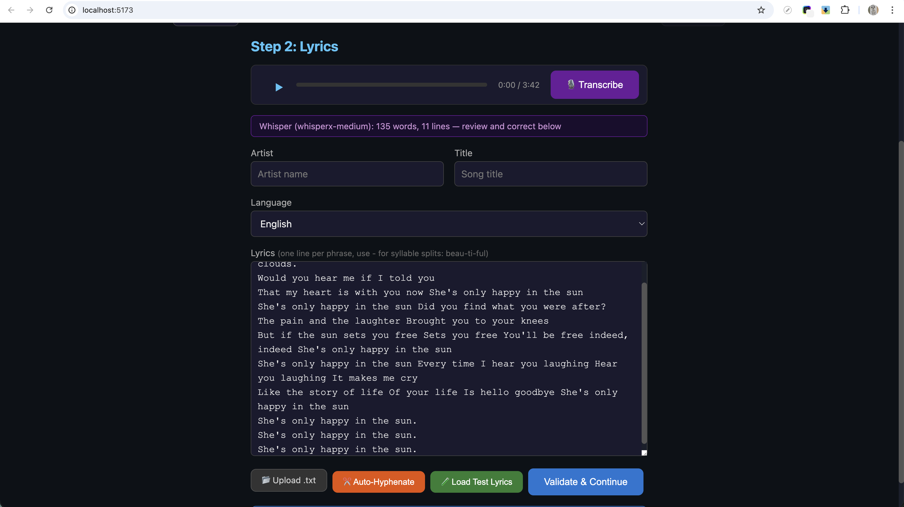
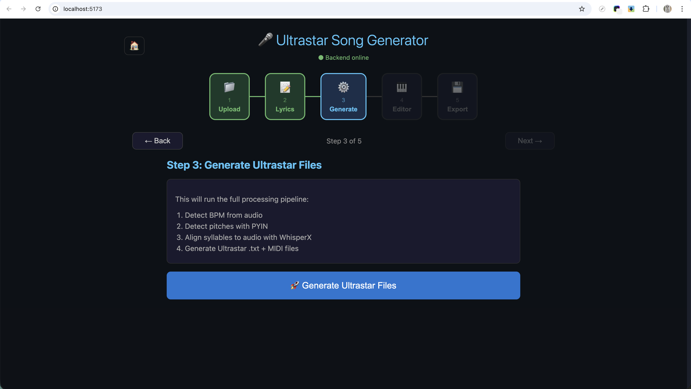
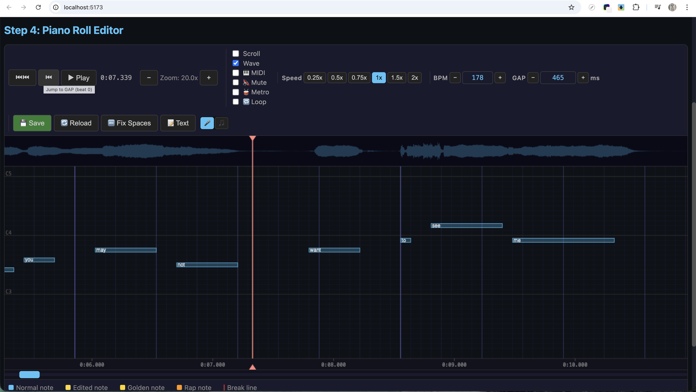
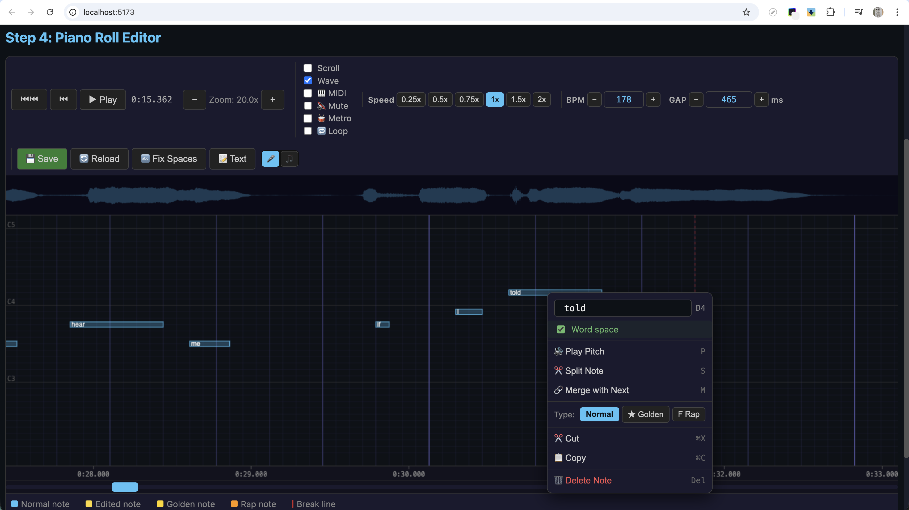
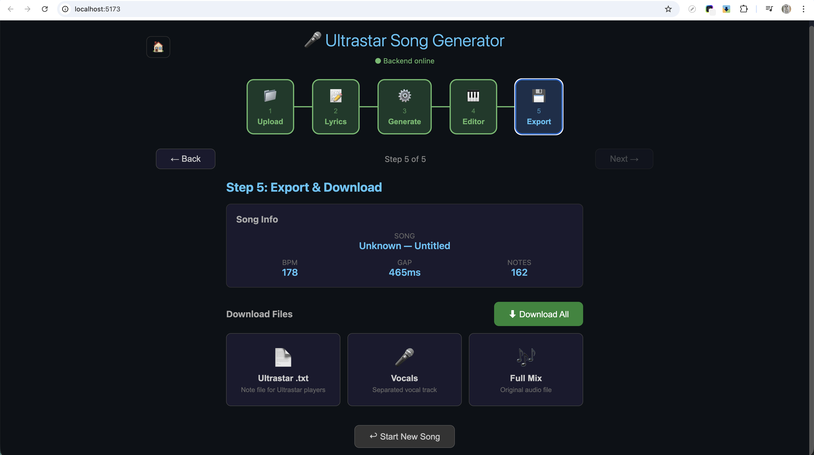

# Ultrastar Creator Tool

A tool to create **Ultrastar karaoke songs** with the help of AI. It guides you through 5 steps — from uploading audio to exporting a ready-to-play Ultrastar .txt file — using automatic vocal separation, pitch detection, and lyrics alignment to do the heavy lifting, while you fine-tune the result in a built-in piano roll editor.

**Goal**: Make it easy for anyone to create Ultrastar songs, so more people sing together. 🎤

## How it Works

| Step | What you do | What the tool does |
|------|-------------|-------------------|
| **1. Upload** | Upload a song (full mix or vocals-only) | Optionally separates vocals using Demucs |
| **2. Lyrics** | Transcribe lyrics | Auto-hyphenates syllables (e.g. `beau-ti-ful`) |
| **3. Generate** | Click "Generate" | Detects BPM, analyzes pitch, aligns syllables to audio |
| **4. Editor** | Review and adjust notes in the piano roll | Shows waveform, plays MIDI pitches, supports grid snap |
| **5. Export** | Download your files | Exports Ultrastar .txt, MIDI, and a processing summary |

## Screenshots

### Project Launcher


### Step 1 — Upload


### Step 2 — Lyrics


### Step 3 — Generate


### Step 4 — Piano Roll Editor




### Step 5 — Export


## Features

### AI Pipeline
- **Vocal separation** (Demucs v4) — isolates vocals from full mix
- **Pitch detection** (PYIN) — robust pitch tracking via librosa
- **Forced alignment** (WhisperX) — syllable-level timing with ~50ms median accuracy, energy-based fallback
- **BPM detection** — automatic tempo analysis with beat-phase alignment
- **Onset snapping** — refines syllable boundaries using spectral onsets
- **One-click generation** — audio → Ultrastar format in minutes

### Piano Roll Editor
- **Full note editing** — move, resize, split, merge, delete notes
- **Golden/Rap note types** — visual indicators (★ gold, orange rap)
- **Grid alignment** (⌘G) — snap the entire beat grid to match the audio
- **GAP adjustment** (⌘S) — click any grid line to set the GAP position
- **Text editor** — edit raw Ultrastar content with live preview
- **Undo/Redo** — full snapshot history (notes, BPM, GAP, headers)
- **Waveform display** — see the audio (full-mix or vocal-track) waveform by the the notes
- **Extra headers** — YOUTUBE, COVER, GENRE and other Ultrastar tags
- **Context menus** — right-click on notes or empty space for quick actions

### Playback & Audio
- **MIDI pitch playback** — hear synthesized pitches during playback (triangle wave)
- **Vocal mute toggle** — isolate MIDI pitches or hear both
- **Audio scrub** — drag the playhead to hear frozen audio grains at any position
- **Drag pitch preview** — hear the pitch while moving notes

### Loop & Navigation
- **Loop regions** — Shift+drag on the time ruler to set a loop, with draggable handles
- **Playhead scrub** — drag the playhead handle with audio + MIDI preview
- **Smart cursors** — move/resize indicators when hovering over notes
- **Keyboard shortcuts** — Space (play), L (loop), Escape (clear loop), arrow keys (seek)

### Project Management
- **Project launcher** — create, open, rename, and delete song projects
- **Session persistence** — projects survive server restarts

### Export
- **Ultrastar .txt** — standard format, compatible with all Ultrastar players
- **MIDI export** — pitch data as MIDI file
- **Processing summary** — detailed report of the AI pipeline

## Architecture

- **Frontend**: Svelte + Vite (port 5173) — 5-step wizard UI with project launcher
- **Backend**: Python FastAPI (port 8001) — service-based with isolated AI workers

## AI Models

| Model | Purpose | Status |
|-------|---------|--------|
| PYIN (librosa) | Pitch detection | Built-in |
| WhisperX | Forced alignment (syllable timing) | Required |
| Demucs v4 | Vocal separation | Optional (can upload vocals directly) |

## Quick Start

### Prerequisites

- **Python 3.10–3.12** with `pip` (3.13+ may have compatibility issues with some AI libraries)
- **Node.js 18+** with `npm`
- **FFmpeg** — required by audio processing libraries

```bash
# macOS
brew install ffmpeg

# Ubuntu/Debian
sudo apt install ffmpeg
```

### 1. Clone & Setup Backend

```bash
git clone https://github.com/retotito/UltrastarCreatorTool.git
cd UltrastarCreatorTool

# Create virtual environment
python3 -m venv .venv
source .venv/bin/activate

# Install Python dependencies (includes PyTorch ~2GB)
pip install -r backend/requirements.txt

# Optional: Pre-download AI models (~3GB, avoids delay on first use)
python backend/download_models.py

# Start backend server (port 8001)
cd backend && python main.py
```

> **Note:** The first time you run "Generate", WhisperX and Demucs will download their AI models automatically (~1–3GB). This can take several minutes depending on your internet connection. You can avoid this wait by running `python backend/download_models.py` after install.

### 2. Setup Frontend (new terminal)

```bash
cd UltrastarCreatorTool/frontend

# Install Node dependencies
npm install

# Start dev server (port 5173)
npm run dev
```

### 3. Open the App

Open **http://localhost:5173** in your browser. The Vite proxy automatically forwards `/api/*` requests to the backend on port 8001.

## VS Code Tasks

Use the pre-configured tasks to start servers:
- **Start Frontend Dev Server** — `cd frontend && npm run dev`
- **Start Backend Server** — `cd backend && python main.py`

## Project Structure

```
frontend/           Svelte app
  src/
    components/     Step1Upload, Step2Lyrics, Step3Generate, Step4Editor, Step5Export
    stores/         Shared state (appStore.js)
    services/       API client (api.js)
backend/            FastAPI server
  services/         AI service modules (pitch, alignment, BPM, vocals, ultrastar, midi)
  workers/          Subprocess isolation for AI tasks
  utils/            Logging, error handling
frontendTest/       Test audio + lyrics files
docs/               Architecture docs, plan
```
